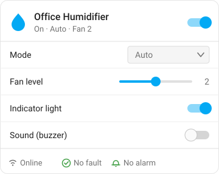

# Humidifier Card

A Lovelace card for a humidifier that Home Assistant exposes as **separate ESPHome entities**
(`switch` / `select` / `number` / `binary_sensor` / `sensor`) rather than as a single
`humidifier.*` or `fan.*` entity — for example a Xiaomi Smart Humidifier 2 flashed with ESPHome.



*Layout illustration — the card picks up your own Home Assistant theme.*

- One `prefix:` line configures all eight entities.
- Mode and fan level grey out while the humidifier is off.
- Status row turns red on connection loss, a device fault or an active alarm.
- Optimistic updates, so the slider does not snap back while you drag it.
- Follows your Home Assistant theme — no hardcoded colours.
- Ships with a GUI editor.

## Installation

### HACS (recommended)

1. HACS → ⋮ (top right) → **Custom repositories**
2. Repository: `https://github.com/iharosi/humidifier-card`
3. Type: **Dashboard** — on older HACS this is called **Plugin** or **Lovelace**
4. Search HACS for **Humidifier Card**, download it, then hard-refresh the browser
   (<kbd>Ctrl/Cmd</kbd>+<kbd>Shift</kbd>+<kbd>R</kbd>)

> Picking **Integration** by mistake fails with *"Repository structure for v0.1.0 is not
> compliant"* — integrations need a `custom_components/` folder, which a dashboard card
> does not have. Remove the custom repository and add it again as **Dashboard**.

HACS registers the dashboard resource for you.

### Manual

1. Copy `dist/humidifier-card.js` to `config/www/humidifier-card.js`
2. Settings → Dashboards → ⋮ → **Resources** → **Add resource**
   URL `/local/humidifier-card.js`, type **JavaScript module**
3. Hard-refresh the browser

## Usage

```yaml
type: custom:humidifier-card
prefix: office_xiaomi_smart_humidifier_2
name: Office Humidifier
```

That derives all eight entities:

| Slot | Entity | Shown as |
| --- | --- | --- |
| `power` | `switch.<prefix>_humidifier` | header toggle |
| `mode` | `select.<prefix>_mode` | dropdown |
| `fan_level` | `number.<prefix>_fan_level` | slider |
| `light` | `switch.<prefix>_indicator_light` | toggle row |
| `sound` | `switch.<prefix>_sound_buzzer` | toggle row |
| `alarm` | `binary_sensor.<prefix>_alarm` | status chip |
| `connection` | `binary_sensor.<prefix>_connection_status` | status chip |
| `fault` | `sensor.<prefix>_device_fault` | status chip |

## Options

| Option | Type | Default | Description |
| --- | --- | --- | --- |
| `type` | string | **required** | `custom:humidifier-card` |
| `prefix` | string | **required**¹ | Entity id prefix without the domain, e.g. `office_xiaomi_smart_humidifier_2` |
| `name` | string | power entity's friendly name | Card title |
| `icon` | string | `mdi:air-humidifier` | Header icon (falls back to `mdi:air-humidifier-off` when off) |
| `show_status` | boolean | `true` | Show the connection / fault / alarm row |
| `hide` | list | `[]` | Slots to leave out, e.g. `[sound, light]` |
| `entities` | map | — | Per-slot entity overrides, any subset of the slots above |

¹ Optional if you supply `entities.power` yourself.

Entity ids that do not exist are skipped and listed once in the browser console, so a partial
setup still renders.

### Full example

```yaml
type: custom:humidifier-card
prefix: office_xiaomi_smart_humidifier_2
name: Office Humidifier
icon: mdi:air-humidifier
show_status: true
hide:
  - sound
entities:
  fan_level: number.office_humidifier_speed
```

## Development

```bash
npm install
npm run lint       # eslint + prettier
npm run typecheck  # tsc --noEmit
npm test           # vitest (jsdom)
npm run build      # -> dist/humidifier-card.js
npm run watch      # rebuild on change
```

`dist/humidifier-card.js` is committed on purpose — HACS falls back to it when a release has no
attached asset. Rebuild it before committing; CI fails if it is stale.

To test against a live instance, symlink the bundle into your Home Assistant config:

```bash
ln -sf "$PWD/dist/humidifier-card.js" /path/to/homeassistant/config/www/humidifier-card.js
```

## Licence

MIT
