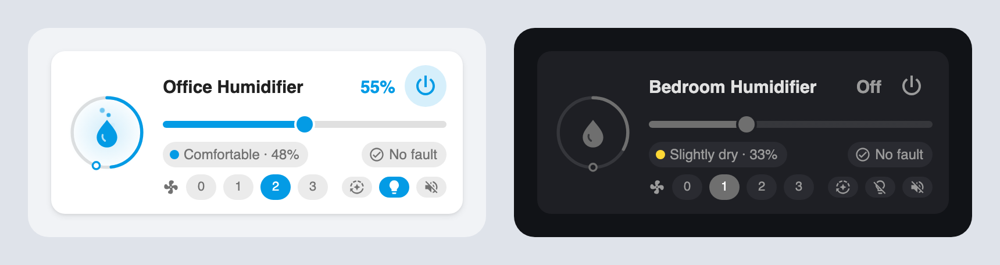

# Humidifier Card

A Lovelace card for a humidifier that Home Assistant exposes as **separate ESPHome entities**
(`switch` / `select` / `number` / `binary_sensor` / `sensor`) rather than as a single
`humidifier.*` or `fan.*` entity — for example a Xiaomi Smart Humidifier 2 flashed with ESPHome.



- Power toggle (tap the dial or the power button)
- Target humidity slider, locked while constant-humidity mode is on
- The dial's ring fills to the current humidity, with a marker at the target
- Mist rises off the drop while it runs, faster at higher fan levels
- Accent colour follows the room humidity (Dry → Very humid)
- Fan level pills, plus mode, indicator light and buzzer toggles
- Device fault chip, shown by default; turns red on a fault or when the device goes offline
- One `prefix:` line configures all nine entities; works with the visual editor

## Installation

### HACS (recommended)

1. HACS → ⋮ (top right) → **Custom repositories**
2. Repository: `https://github.com/iharosi/humidifier-card`
3. Type: **Dashboard** — on older HACS this is called **Plugin** or **Lovelace**
4. Search HACS for **Humidifier Card**, download it, then hard-refresh the browser
   (<kbd>Ctrl/Cmd</kbd>+<kbd>Shift</kbd>+<kbd>R</kbd>)

> Picking **Integration** by mistake fails with *"Repository structure for v0.1.0 is not
> compliant"* — integrations need a `custom_components/` folder, which a dashboard card
> does not have. Remove the custom repository and add it again as **Dashboard**.

HACS registers the dashboard resource for you.

### Manual

1. Copy `dist/humidifier-card.js` to `config/www/humidifier-card.js`
2. Settings → Dashboards → ⋮ → **Resources** → **Add resource**
   URL `/local/humidifier-card.js`, type **JavaScript module**
3. Hard-refresh the browser

## Usage

```yaml
type: custom:humidifier-card
prefix: smart_humidifier
name: Office Humidifier
```

That derives all nine entities:

| Slot | Entity | Shown as |
| --- | --- | --- |
| `power` | `switch.<prefix>_humidifier` | power button; tapping the dial toggles it too |
| `target_humidity` | `number.<prefix>_target_humidity` | slider, and the big value next to the name |
| `humidity` | `sensor.<prefix>_humidity` | the dial's ring and the coloured chip |
| `fan_level` | `number.<prefix>_fan_level` | one pill per level; sets the mist speed |
| `mode` | `select.<prefix>_mode` | toggle pill, or a text pill with more than two options |
| `light` | `switch.<prefix>_indicator_light` | toggle pill |
| `sound` | `switch.<prefix>_sound_buzzer` | toggle pill |
| `fault` | `sensor.<prefix>_device_fault` | status chip |
| `connection` | `binary_sensor.<prefix>_connection_status` | status chip, only when offline |

## Options

| Option | Type | Default | Description |
| --- | --- | --- | --- |
| `type` | string | **required** | `custom:humidifier-card` |
| `prefix` | string | **required**¹ | Entity id prefix without the domain, e.g. `smart_humidifier` |
| `name` | string | power entity's friendly name | Card title |
| `mode_on` | string | second option | Mode option that counts as "on" — see [Mode](#mode) |
| `show_status` | boolean | `true` | Show the device fault / offline chip |
| `dim_when_off` | boolean | `false` | Disable target, fan level and mode while the humidifier is off |
| `hide` | list | `[]` | Slots to leave out, e.g. `[sound, light]` |
| `entities` | map | — | Per-slot entity overrides, any subset of the slots above |

¹ Optional if you supply `entities.power` yourself.

Entity ids that do not exist are skipped and listed once in the browser console, so a partial
setup still renders.

### Mode

A mode select with exactly two options is drawn as a toggle pill. The second option counts as
"on":

```yaml
# ESPHome
select:
  - platform: miot
    name: "Mode"
    options:
      0: "None"                # pill off
      1: "Constant Humidity"   # pill on
```

Set `mode_on` when the order is the other way round, or to force the toggle on a select with more
than two options — every other option then counts as "off". Without `mode_on`, a longer list
gets a text pill showing the current mode that steps to the next one on tap.

```yaml
mode_on: Constant Humidity
```

Hover the pill to see the current mode.

While the mode is **on**, the target humidity slider is disabled — the device is
regulating to the target itself. It becomes editable again when the mode is off.

### Full example

```yaml
type: custom:humidifier-card
prefix: smart_humidifier
name: Office Humidifier
mode_on: Constant Humidity
show_status: true
dim_when_off: false
hide:
  - sound
  - humidity
entities:
  fan_level: number.office_humidifier_speed
```

## Humidity colours

The card is tinted by the current humidity while it runs, and turns grey when it is off. The chip's
dot keeps its colour either way.

| Humidity | Label | Colour |
| --- | --- | --- |
| ≤ 30 % | Dry | orange |
| ≤ 40 % | Slightly dry | yellow |
| ≤ 60 % | Comfortable | blue |
| ≤ 70 % | Humid | indigo |
| > 70 % | Very humid | purple |

## Development

```bash
npm install
npm run lint       # eslint + prettier
npm run typecheck  # tsc --noEmit
npm test           # vitest (jsdom)
npm run build      # -> dist/humidifier-card.js
npm run watch      # rebuild on change
```

`dist/humidifier-card.js` is committed on purpose — HACS falls back to it when a release has no
attached asset. Rebuild it before committing; CI fails if it is stale.

To test against a live instance, symlink the bundle into your Home Assistant config:

```bash
ln -sf "$PWD/dist/humidifier-card.js" /path/to/homeassistant/config/www/humidifier-card.js
```

## Licence

MIT
